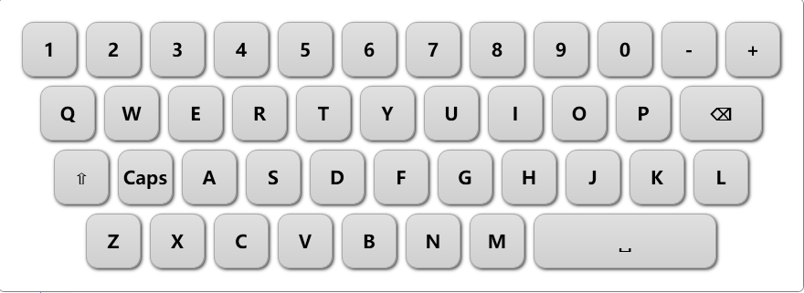
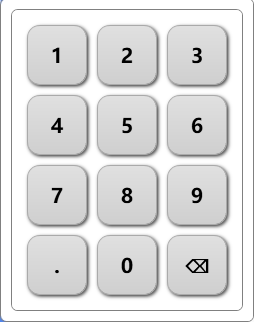

# 📦 WpfTouchKeyboard

**WpfTouchKeyboard** is a lightweight, customizable on-screen virtual keyboard for WPF applications.

It supports both full alphanumeric keyboards and numeric-only keyboards, and is ideal for touch devices, kiosks, or password input scenarios.

---

## ✨ Features

- 🧩 Plug-and-play: just call `Register()` to enable support
- ⌨️ Supports full and numeric keyboard layouts
- 🔐 Secure PasswordBox support
- 🖱️ Automatically opens on focus of `TextBox` or `PasswordBox`
- 🔁 Switch keyboard type at runtime
- 🎨 Easy to style with XAML

---

## 🚀 Getting Started

### 1. Install via NuGet

```bash
dotnet add package WpfSimpleTouchKeyboard
```

### 2. Register the keyboard on app startup

```bash
KeyboardManager.Register();
```

### 3. Disable the virtual keyboard for specific TextBox controls
When you do not want the virtual keyboard to be activated for certain TextBox controls, you can disable it by setting the following attached property:

```bash
<TextBox keyboard:KeyboardManager.EnableKeyboard="False" />
```

### 4. Enable Chinese Input
To enable Chinese input on the virtual keyboard, make sure that a Chinese IME (such as Microsoft Pinyin) is installed and available in the system.

```bash
KeyboardManager.Register();
KeyboardManager.ShowLanguageToggleButton = true;
```
Sample:





